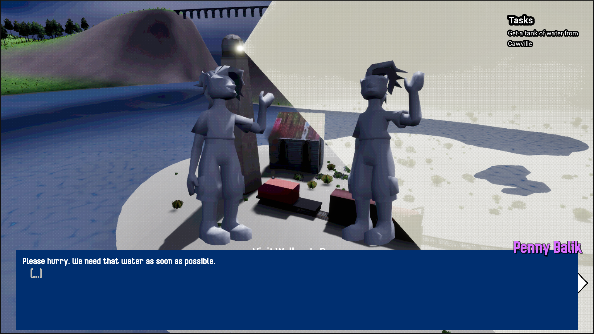

# Gameplay Media

# About

Many years of technological advancements have let civilization prosper, leading to ever growing cities becoming dense centers of life. However, world elites go offworld under assumptions of worldwide shutdowns due to a millennium tick-over, leaving behind everyone to deal with it.  When that never happens they leave it to their middle-men and automated supply lines to take care of things whilst leaving those out of the loop to fall apart.  It's been months since and the situation outside of the major cities is getting more dire.  Upon finding a semi-decommissioned train station and in it a working train line that connects to nearby settlements, Trak decides to take it up to themself to do whatever they can to help those in need.

# Credits

(in alphabetical order by last name)

- Li “Usagi” Brady
    - [@WiredUsagi](https://twitter.com/wiredusagi)
    - Ideation Contributor
    - Environment Artist & Texture Artist
- Jamie Doherty
    - [@drslowpokephd](https://cohost.org/drslowpokephd) | [jamiedoherty.xyz](http://jamiedoherty.xyz)
    - Ideation Contributor
    - Gameplay Programmer (Quest and Dialogue)
- Alex McGivern
    - [@aeonofdiscord](https://icosahedron.website/@aeonofdiscord) | [aeonofdiscord.com](http://aeonofdiscord.com)
    - Ideation Contributor
    - Programming Lead
    - Quest Designer
    - Writer (Dialogue)
- Thana Orchard
    - [@ThanaOrchard](https://twitter.com/thanaorchard) on all platforms | [linktr.ee/ThanaOrchard](http://linktr.ee/ThanaOrchard)
    - Ideation Contributor
    - Art Lead
    - Character Artist
- Debora Willey
    - [@DebHatesDeb](https://twitter.com/DebHatesDeb) | [thedebaucheryden.com](http://thedebaucheryden.com)
    - Ideation Contributor
    - Narrative Lead
    - Writer (Lore and World building)
- Zoë Wolfe
    - [@glitch_wolfe](https://twitter.com/glitch_wolfe) | [glitchwolfe.studio](http://glitchwolfe.studio)
    - Ideation Contributor
    - UI Artist
- Shannon “Xanna” Zatz
    - [@XannaInternet](https://twitter.com/XannaInternet)
    - Ideation Contributor
    - Special Thanks

(Not everyone who worked on the game is credited for personal reasons)

# Development Videos

Ocean sound and train noise implementations
<video src="/OceanSoundsAndEngineNoise.webm" controls/>

Character Animations and UI
<video src="/AnimCharactersAndUI.webm" controls/>

Lighting Pass
<video src="FirstLightingPass.webm" controls/>

Foliage and VFX implementation
<video src="FoliageAndSmoke.webm" controls/>
